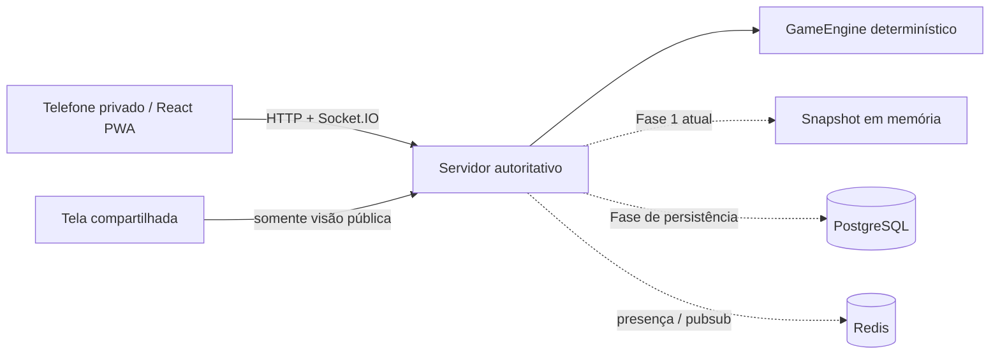

# Arquitetura

Monorepo npm workspaces: `apps/web` é React/Vite PWA-ready; `apps/server` é Express/Socket.IO; `packages/game-core`, `game-engines`, `protocol` e `content-schema` são contratos sem UI. O servidor autentica token opaco no handshake, valida schema e versão esperada, executa a engine, registra idempotência e publica projeções separadas. O adaptador de memória será substituído por snapshot/eventos PostgreSQL e Redis sem alterar engines.
